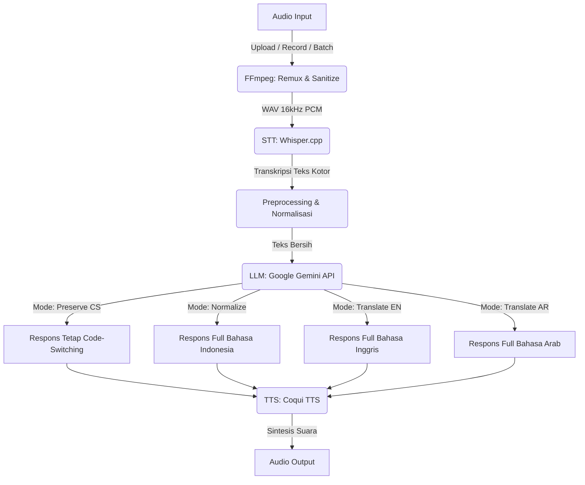

# Voice Code-Switching Speech-to-Speech System

Proyek ini adalah sistem **Multilingual Speech-to-Speech (S2S) End-to-End** tingkat lanjut yang dirancang khusus untuk memproses, memahami, dan merespons ujaran yang mengandung *Code-Switching* (percampuran bahasa) antara **Bahasa Indonesia, Inggris, dan Arab**. 

Sistem ini dikembangkan sebagai pemenuhan Project Akhir Praktikum Natural Language Processing (NLP) 2025/2026 Genap.

---

## Arsitektur & Pipeline Sistem

Sistem ini dibangun di atas arsitektur *pipeline* yang kokoh, menghubungkan berbagai model AI (STT, LLM, TTS) menjadi satu aliran yang terintegrasi:



### Penjelasan Komponen Inti:
1. **FFmpeg Remux (Pre-processing)**: Modul pertahanan sistem yang bekerja di latar belakang. Otomatis "mencuci" (*remux*) dan menstandarisasi file audio apa pun menjadi WAV murni (16kHz PCM) agar kebal terhadap file rusak atau *fake extension*.
2. **STT (Speech-to-Text)**: Menggunakan model *Whisper* via `whisper.cpp` untuk menangkap suara pengguna secara luring (*offline*) dan mengubahnya menjadi teks, seakurat mungkin menangkap campuran bahasa.
3. **Text Processing**: Teks hasil STT dibersihkan dari anomali pendengaran mesin (misal: "jam jam" menjadi "zamzam") menggunakan modul Regex yang terpusat di `utils.py`.
4. **LLM (Large Language Model)**: Menggunakan kecerdasan **Gemini Gemma 4 (31B)** via API. Model ini bertugas memahami konteks ucapan pengguna dan memberikan respons yang relevan sesuai mode yang dipilih.
5. **TTS (Text-to-Speech)**: Memanfaatkan **Coqui TTS** dengan model VITS berbahasa Indonesia untuk menyintesis teks respons LLM kembali menjadi suara audio yang terdengar natural.

---

## Fitur Unggulan Proyek

Selain menjalankan fungsi S2S dasar, proyek ini dilengkapi dengan arsitektur penunjang tangguh (*Production-Ready*):
- **Automatic Audio Sanitation (Remux):** Kebal terhadap manipulasi ekstensi file (seperti `.m4a` yang di-rename manual).
- **Fault-Tolerant LLM:** Perlindungan terhadap *Rate Limit* (429) dan *Server Error* (500) dengan sistem *fallback* model cadangan otomatis.
- **Robust Batch Processing:** Evaluasi ratusan audio secara otonom dengan dukungan *Checkpointing JSON* (bisa di-*resume* jika terputus).
- **Global Centralized Logging:** Perekaman jejak aktivitas dan latensi ke dalam file fisik rotasi `log/app.log`.
- **Unified UI Workspace:** Antarmuka satu pintu (Gradio) untuk fitur *Upload*, *Record*, maupun evaluasi *Batch*.

---

## Struktur Direktori

```text
voice-cs-system/
├── .env                         # Konfigurasi rahasia & API Key (Jangan di-commit!)
├── .gitignore                   # Menjaga repo bebas dari log/model berukuran raksasa
├── requirements.txt             # Daftar library Python
├── README.md                    # Dokumentasi utama proyek
├── app/
│   ├── main.py                  # FastAPI Endpoint (Backend deployment)
│   ├── pipeline.py              # Logika inti alur S2S (STT -> LLM -> TTS)
│   ├── stt.py                   # Modul interaksi subprocess dengan Whisper.cpp
│   ├── llm.py                   # Modul prompt & koneksi API ke Google Gemini
│   ├── tts.py                   # Modul sintesis suara offline Coqui
│   ├── utils.py                 # Modul preprocessing teks & transliterasi
│   ├── file_manager.py          # Modul pengelola penyimpanan & temp files
│   ├── logger.py                # Utilitas sistem pencatatan log otomatis
│   ├── evaluator.py             # Logika kalkulasi matriks evaluasi (WER/CER)
│   └── coqui_tts/data/          # Folder WAJIB tempat meletakkan model VITS (Manual Download)
├── corpus/
│   └── audio/                   # Folder berisi dataset audio (WAV) untuk evaluasi batch
├── output/
│   ├── manual/                  # Output audio uji coba via antarmuka Gradio
│   └── batch/                   # Output rapi evaluasi skala besar (dibagi per NPM)
├── log/
│   └── app.log                  # File rekam jejak sistem (dibuat secara otomatis)
├── models/
│   └── whisper.cpp/             # Folder WAJIB tempat model Whisper (Manual Build/Download)
├── scripts/
│   └── dictionary.md            # Catatan ground truth & transliterasi
└── gradio_app/
    ├── app.py                   # Antarmuka Pengguna (GUI) interaktif via Gradio
    ├── analisis_pipeline.py     # Skrip CLI khusus untuk Batch Evaluasi Dataset
    └── theme.py                 # File penataan gaya (CSS) UI Gradio
```

---

## Panduan Setup & Instalasi

### 1. Persiapan Lingkungan (Virtual Environment)
Sistem ini dirancang berjalan di dalam *Virtual Environment* agar dependensinya tidak bentrok.
```bash
# Lakukan Clone Repositori
git clone https://github.com/M-Aidil-Fitrah/UAS-Prak-NLP-STS-System.git
cd UAS-Prak-NLP-STS-System

# Membuat VENV
python -m venv venv

# Aktivasi VENV (Windows)
venv\Scripts\activate
# Aktivasi VENV (Linux/Mac)
source venv/bin/activate
```

### 2. Instalasi Pustaka
```bash
pip install -r requirements.txt
```

### 3. Konfigurasi Kunci API
Buat file baru bernama `.env` di *root* proyek (sejajar dengan `README.md`) dan isi dengan kredensial API Gemini Anda:
```env
GEMINI_API_KEY=ISIKEYDISINI.
GEMINI_MODEL=models/ISIMODELDISINI(misal: gemma-4-31b-it)
```

---

## Panduan Instalasi Model STT dan TTS (Sangat Penting)
Agar *repository* Github tidak membengkak, saya membuat model STT dan TTS dimasukkan ke dalam `.gitignore`. Anda **WAJIB** mengunduh dan menyusunnya secara manual mengikuti langkah-langkah presisi berikut:

### A. Konfigurasi STT (Whisper.cpp)
Kita tidak menggunakan Whisper versi Python karena lambat. Kita menggunakan versi C++ (`whisper.cpp`) yang sangat cepat.
1. Masuk ke dalam direktori proyek Anda di terminal.
2. *Clone* kode sumber `whisper.cpp` ke dalam folder `models/`:
   ```bash
   git clone https://github.com/ggml-org/whisper.cpp.git models/whisper.cpp
   ```
3. Masuk ke folder tersebut dan lakukan proses *Build/Compile* menggunakan CMake:
   ```bash
   cd models/whisper.cpp
   cmake -B build
   cmake --build build --config Release
   ```
4. Setelah berhasil di-*build*, unduh model audionya (pilih model `small` yang berukuran ±470MB dan ramah spesifikasi menengah):
   ```bash
   # Jika di Linux/Mac/Git Bash Windows
   bash ./models/download-ggml-model.sh small
   ```
5. Kembali ke *root* direktori proyek:
   ```bash
   cd ../..
   ```

### B. Konfigurasi TTS (Coqui Indonesian-VITS v1.2)
Kita menggunakan model sintesis suara luring (*offline*) berbahasa Indonesia buatan *Wikidepia*.
1. Pergi ke *repository* modelnya: [https://github.com/wikidepia/indonesian-tts](https://github.com/wikidepia/indonesian-tts)
2. Unduh **tiga** file wajib ini:
   - `checkpoint_1260000-inference.pth` (Atau versi checkpoint terbarunya)
   - `config.json`
   - `speakers.pth`
3. Buat folder bernama `data` di dalam folder `app/coqui_tts/` (jika belum ada).
4. Letakkan ketiga file yang telah diunduh tersebut ke dalam:
   ```text
   app/coqui_tts/data/
   ├── checkpoint_1260000-inference.pth
   ├── config.json
   └── speakers.pth
   ```

---

## Cara Menjalankan Aplikasi

Aplikasi S2S ini dapat dieksekusi dalam tiga mode berbeda tergantung kebutuhan Anda:

### 1. Menjalankan Backend API (FastAPI)
Jika Anda ingin menjadikan sistem ini sebagai layanan API (Endpoint) yang bisa diakses oleh aplikasi lain (misal aplikasi Mobile atau Web App), jalankan server intinya:
```bash
uvicorn app.main:app --reload --host 0.0.0.0 --port 8000
```
*API akan aktif di `http://127.0.0.1:8000/voice-chat`*

### 2. Menjalankan UI Interaktif (Gradio)
Mode presentasi visual. Anda dapat menguji merekam suara langsung melalui mikrofon atau mengunggah audio, lalu melihat bagaimana sistem mengubah teks dan memutar suara responsnya secara *real-time*.
```bash
python gradio_app/app.py
```
*Akses visual UI di browser Anda pada alamat `http://127.0.0.1:7860`*

### 3. Menjalankan Evaluasi Massal (CLI Batch Processor)
Mode ini dikhususkan untuk **pengujian Project Akhir**. Mode ini akan memproses puluhan/ratusan audio di folder `corpus/audio/`, mencatat nilai Word Error Rate (WER) dan Latensi, lalu merangkumnya dalam bentuk CSV dan Grafik.
Fitur ini kebal *error* (memiliki sistem *Checkpoint* otomatis).
```bash
python gradio_app/analisis_pipeline.py
```
*Output hasil evaluasi akan disortir per NPM di dalam `output/batch/`.*

---

## Kamus Referensi Dataset (Ground Truth)

Berikut adalah daftar kalimat wajib (*Mandatory*) dan bebas (*Free-Pick*) yang diujikan dalam korpus untuk penilaian matriks keakuratan:

| ID | Kategori | Kalimat Referensi (Transliterasi) |
|---|---|---|
| 01 | ID-EN | Aku mau book flight ke Jeddah minggu depan, bisa bantu schedule? |
| 02 | ID-EN | Aku butuh travel umrah simple tapi include Madinah visit |
| 03 | EN-ID | Can you help aku arrange transport dari Jeddah ke Madinah tomorrow |
| 04 | EN-ID | Explain step by step cara apply visa Saudi dengan benar |
| 05 | AR-EN-ID | يَا أَخِي، أُرِيدُ book flight إِلَى Jeddah الأُسْبُوع القَادِم. هَلْ bisa bantu أَجِد أَفْضَل schedule وَرِحْلَةً مُبَاشِرَةً؟ <br>*(Ya akhi, uridu book flight ila Jeddah al-usbu'al qadim. Hal bisa bantu ajida afdhal schedule wa rihlatan mubashirah?)* |
| 06 | AR-EN | أُرِيدُ arrange transport مِن Jeddah إِلَى Madinah غَدًا <br>*(Urīdu arrange transport min Jeddah ilā Madinah ghadan)* |
| 07 | Commands | Book flight ke Jeddah lalu lanjut ke Madinah, schedule terbaik kapan |
| 08 | Commands | اريد schedule trip dari Jeddah ke Makkah besok pagi <br>*(uridu schedule trip min jeddah ila makkah bukra sabah)* |
| 09 | Commands | ممكن book transport dari Makkah ke Madinah untuk besok <br>*(mumkin book transport min makkah ila madinah untuk besok?)* |
| 10 | Info | Apa perbedaan umrah dan hajj secara detail dalam Islam |
| 11 | Info | Kenapa fasting di Ramadan itu wajib bagi Muslim |
| 12 | Info | Bagaimana proses visa Saudi untuk umrah dari Indonesia sekarang |
| 13 | Instruct | Jelaskan step by step cara booking flight ke Jeddah secara online |
| 14 | Instruct | How to prepare dokumen umrah dari Indonesia dengan benar |
| 15 | Instruct | Tolong buat checklist persiapan umrah termasuk barang wajib dibawa |
| 16 | Instruct | Guide aku cara pilih hotel di Makkah dekat Haram dengan budget terbatas |
| 17 | Social | Menurut kamu belajar bahasa Arab itu susah gak untuk pemula |
| 18 | Social | I feel overwhelmed dengan persiapan umrah, ada tips sederhana? |
| 19 | Social | احيانا saya bingung mulai dari mana untuk umrah <br>*(ahyanan saya bingung mulai dari mana untuk umrah)* |
| 20 | Transform | Translate ke English: aku mau pergi ke Makkah minggu depan |

---

## Referensi Repositori

Proyek ini dibangun dengan mengintegrasikan beberapa proyek Sumber Terbuka (*Open-Source*) yang menakjubkan:

- [OpenAI Whisper](https://github.com/openai/whisper) — *Robust Speech Recognition via Large-Scale Weak Supervision*
- [ggml-org/whisper.cpp](https://github.com/ggml-org/whisper.cpp) — *High-performance inference of OpenAI's Whisper automatic speech recognition (ASR) model*
- [Google AI — Gemini API](https://ai.google.dev/gemini-api/docs) — *Gemma & Gemini Pro Large Language Models*
- [idiap/coqui-ai-TTS](https://github.com/idiap/coqui-ai-TTS) — *A deep learning toolkit for Text-to-Speech, battle-tested in research and production*
- [wikidepia/indonesian-tts](https://github.com/wikidepia/indonesian-tts) — *Pre-trained Indonesian TTS Models (VITS)*
